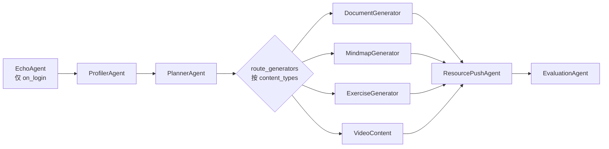

# 智能体与流水线

## 摘要

本文档描述星识 Star-Learn 的多智能体层：9 个 V1 legacy Agent（agents.py）+ 3 个 V2 命名实体 Agent（app/agents/）+ MasterController 编排链 + tutor_engine 新流水线（InputGateway → IntentRouter → SocraticEngine → OutputGateway）。理解 Agent 注册、编排图、消息契约（AgentEnvelope），可以扩展新 Agent 或修改编排。

## 前置知识

- [架构设计.md](架构设计.md) — 总架构图
- [后端服务.md](后端服务.md) — main.py 单体与路由

## 内容

### V1 Agent 注册（agents.py）

`agents.py:33 BaseAgent(ABC)` 是抽象基类，提供 `name` / `description` / `enabled` 属性与 `async def run(state, **kwargs)` 接口。9 个具体 Agent：

| Agent | 行号 | 角色 |
|---|---|---|
| `ProfilerAgent` | `agents.py:62` | 画像分析（更新 6 维雷达：knowledge_mastery / weakness / cognitive_style / focus_level / learning_goals） |
| `PlannerAgent` | `agents.py:316` | 任务规划，输出 `PlannerOutput(content_types)` |
| `DocumentGeneratorAgent` | `agents.py:396` | 富文本讲义生成 |
| `MindmapGeneratorAgent` | `agents.py:447` | Mermaid 思维导图生成 |
| `ExerciseGeneratorAgent` | `agents.py:514` | 练习题变体生成 |
| `VideoContentAgent` | `agents.py:569` | 视频内容推荐 |
| `ResourcePushAgent` | `agents.py:599` | 学习资源推送 |
| `EvaluationAgent` | `agents.py:629` | 学习效果评估 |
| `SocraticEvaluatorAgent` | `agents.py:667` | 苏格拉底式问答（5 种 persona × socratic_intensity） |
| `EchoAgent` | `agents.py:1276` | 入门回显 |
| `FlashcardAgent` | `agents.py:1379` | 闪卡（注册但默认不在流水线）|

### MasterController 编排

`agents.py:1116 MasterController` 是链式编排器，`create_default_controller()`（`agents.py:1698`）工厂方法构建默认实例。`main.py:3745 get_controller()` 懒加载单例。

执行图：



`route_generators` 路由规则（`agents.py` 内）：

- `ContentType.TEXT / DOCUMENT` → DocumentGenerator
- `ContentType.MERMAID / MINDMAP` → MindmapGenerator
- `ContentType.EXERCISE / CODE` → ExerciseGenerator
- `ContentType.VIDEO` → VideoContent
- `dialogue_type == "confusion"` → DocumentGenerator 强制前置
- 默认 → DocumentGenerator

并行执行（`asyncio.gather`）但**所有生成器共享同一个 `state` 对象**（通过 `state.__dict__.update(state_local.__dict__)`），依赖 `_GENERATOR_OUTPUT_KEYS` 查找表避免键冲突。

### V2 命名实体 Agent（app/agents/）

| Agent | 文件 | 角色 |
|---|---|---|
| `RecommendAgent` | `app/agents/recommend.py` | 可解释推荐（M2.1，离线、确定性） |
| `AuditAgent` | `app/agents/audit.py` | 越狱 + 防幻觉 4 层防御（M2.2） |
| `CriticAgent` | `app/agents/critic.py` | L3 独立评审（M4.4） |

`io_schema.py` 定义消息契约：

```python
class AgentRole(str, Enum):
    PROFILER = "profiler"
    PLANNER = "planner"
    SOCRATIC = "socratic"
    RECOMMEND = "recommend"
    CRITIC = "critic"
    AUDIT = "audit"

@dataclass
class AgentEnvelope:
    trace_id: str
    role: AgentRole
    payload: dict
    latency_ms: int = 0
    fallback: bool = False   # LLM/KB 不可用时为 True
    provider: str = ""       # 调用来源（ark/qwen/human）
    error: str = ""
```

`wrap_agent_call` 装饰器在 `io_schema.py` 末尾，可在不修改 `agents.py` 的情况下为旧 Agent 注入 Envelope。

### tutor_engine 新流水线

`app/services/tutor_engine/` 是替代旧 MasterController 的新流水线（M3 起逐步上线）：

| 文件 | 角色 |
|---|---|
| `pipeline_gate.py` | 主流程 `InputGateway → IntentRouter → SocraticEngine → OutputGateway` |
| `engine.py` | `TutorDecisionEngine` 主类 |
| `hallucination_guard.py` | 防幻觉守门（v2 模式由 `GUARD_V2_MODE` 控制） |
| `context_aggregator.py` | 上下文聚合（5 维画像 + 记忆 + 知识） |
| `capability_aggregator.py` | 能力画像聚合 |
| `link_recommender.py` | 链接推荐 |
| `mascot_adapter.py` | 适配 mascot（小星）SSE 协议 |
| `proactive_advisor.py` | 主动推送建议 |
| `response_composer.py` | 响应组装 |
| `action_ledger.py` | 动作账本（追踪 UI action） |

切换控制：环境变量 `GUARD_V2_MODE = off | shadow | enforce`（默认 `enforce`）。

### 5 种教师 Persona（app/services/teacher/personas.py）

| ID | 名称 | socratic_intensity | 默认 |
|---|---|---|---|
| `patient_tutor` | 陈默 | 0.4 | — |
| `socratic_questioner` | 林问 | 1.0 | — |
| `energetic_lecturer` | 周燃 | 0.1 | — |
| `expert_mentor` | 严铮 | 0.7 | **✓** `DEFAULT_PERSONA_ID` |
| `caring_counselor` | 苏语 | 0.0 | —（含 crisis_keywords：自残/自杀/想死 等） |

`PersonaManager.build_system_prompt(intensity)` 按强度动态注入苏格拉底规则（强度带：0.0 / ≤0.2 / ≤0.5 / ≤0.8 / >0.8）。

### 安全：4 层防御

| 层 | 模块 | 触发 |
|---|---|---|
| L0 越狱 | `app/services/safety/jailbreak_detector.py` | 正则扫描 < 50ms |
| L1 引用锚定 | `app/agents/audit.py:_check_hallucination` | 检查知识源存在 |
| L2 长度/模板 | 同上 | 输出形态检测 |
| L3 综合评分 | `AuditAgent.run` 聚合 | 返回 `AuditResult` |

L0 阈值：jailbreak_score ≥ 0.7 拦截；hallucination_score ≥ 0.6 拦截。

## 代码定位

- V1 抽象基类：`agents.py:33`
- MasterController：`agents.py:1116`
- 工厂方法：`agents.py:1698`
- 全局单例：`main.py:3745`
- V2 Agent：`app/agents/{recommend,audit,critic}.py`
- 消息契约：`app/agents/io_schema.py`
- 新流水线：`app/services/tutor_engine/pipeline_gate.py`
- Persona 注册：`app/services/teacher/personas.py`
- 安全：`app/services/safety/jailbreak_detector.py`

## 常见坑

- **并行生成器共享 state**：Document / Mindmap / Exercise / Video 并行写 `state`，依赖 `_GENERATOR_OUTPUT_KEYS` 表保证键不冲突；扩展新生成器时必须更新该表
- **Agent 名 vs class 名**：前端 `_AGENT_DISPLAY` 字典（`app/api/agent_orchestration.py`）独立维护一份"显示名 ↔ icon ↔ content_type"映射；改名要同步
- **`SocraticEvaluatorAgent` 在 catalog 但不在默认流水线**：通过 `app/api/agent_orchestration.py:GET /api/agents/catalog` 暴露，但 MasterController 默认不调用；要手动加
- **V1/V2 混用**：`main.py` 内联路由直接 `from agents import ProfilerAgent`（V1），`app/services/tutor_engine/` 调用 `app/agents/audit.py`（V2）；切勿假设一个端点走的是哪条路
- **`PersonaManager.auto_select()` 不选 `caring_counselor`**：仅 `app/services/teacher/persona_selector.py::auto_select_persona()`（带 emotion 分支）可选 `caring_counselor`

## 相关链接

- [架构设计.md](架构设计.md)
- [后端服务.md](后端服务.md)
- [子系统详解.md](子系统详解.md)
- [可观测性与安全.md](可观测性与安全.md)