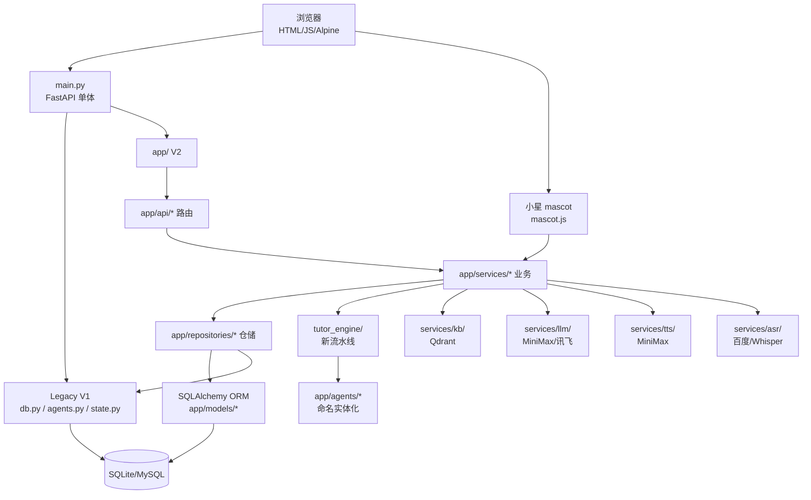

# 架构设计

## 摘要

本文档描述星识 Star-Learn 的总体架构：双层代码组织（V1 legacy + V2 app/）、多智能体编排图（6 个 Agent + MasterController + tutor_engine 流水线）、仓储双写与灰度切流、外部服务依赖关系。理解本文档后，可以从任意子系统入手快速定位代码。

## 前置知识

- [项目说明.md](项目说明.md) — 一句话定位与能力清单

## 内容

### 总体架构图

### 双层代码组织（V1 / V2）

| 层 | 路径 | 状态 | 用途 |
|---|---|---|---|
| V1 Legacy | 根目录 `main.py / agents.py / db.py / state.py` + `agent_utils.py / llm_stream.py / proactive_tutor.py / task_manager.py` | 仍在运行 | 单体入口、Pydantic 状态、传统数据访问、MasterController 编排 |
| V2 重构 | `app/`（api/core/models/schemas/services/agents/repositories/prompts）| 主线开发 | 模块化路由、SQLAlchemy ORM、仓储抽象、新 Agent 命名空间 |

**迁移策略**：V2 通过 `app/repositories/dual_write.py` + `app/core/repository_factory.py` 同时写 V1（legacy 仓储）和 V2（ORM），读路径按 feature flag 灰度切流。

### 6 个 Agent

| Agent | 文件 | 角色 |
|---|---|---|
| ProfilerAgent | `agents.py:62` | 画像分析（更新6 维雷达）|
| PlannerAgent | `agents.py:316` | 任务规划 |
| DocumentGeneratorAgent | `agents.py:396` | 文档生成 |
| MindmapGeneratorAgent | `agents.py:447` | 思维导图 |
| ExerciseGeneratorAgent | `agents.py:514` | 练习题生成 |
| VideoContentAgent | `agents.py:569` | 视频内容 |
| ResourcePushAgent | `agents.py:599` | 资源推送 |
| EvaluationAgent | `agents.py:629` | 评估 |
| SocraticEvaluatorAgent | `agents.py:667` | 苏格拉底式问答 |
| RecommendAgent | `app/agents/recommend.py` | 可解释推荐（M2.1）|
| AuditAgent | `app/agents/audit.py` | 越狱 + 防幻觉（M2.2）|
| CriticAgent | `app/agents/critic.py` | L3 独立评审（M4.4）|

MasterController（`agents.py:1116`）调度：`Echo → Profiler → Planner → DocumentGenerator/MindmapGenerator/ExerciseGenerator/VideoContent（并行）→ ResourcePush → Evaluation`

### 仓储双写与灰度切流

- 读路径：`get_repository_for_user(user_id, type)`（`app/core/repository_factory.py:97`）→ 若 `is_orm_enabled()` 且 `user_in_orm_read_path(user_id, pct)`（md5 hash 桶分）→ ORM；否则 legacy
- 写路径：`get_write_repository(user_id, type)` → 主 ORM；若 `is_dual_write_enabled()` → `DualWriteRepository(primary=ORM, shadow=legacy)`
- Feature flags：`app/core/feature_flags.py` — `ORM_ENABLED` / `READ_BACKEND_PERCENTAGE` / `DUAL_WRITE_LEGACY` / `GUARD_V2_MODE` / `MEMORY_V2` / `SELF_CHECK_ENABLED` / `EMBEDDING_PROVIDER`

### 路由前缀总表（部分）

| 前缀 | 文件 | 主要端点 |
|---|---|---|
| `/api/v2` | `app/api/__init__.py` | tts/asr/grading/teacher_chat/ppt |
| `/api` | `main.py:330-350` | memory/profile/evaluation/mascot |
| `/api/learning-path` | `main.py:326` | learning_path |
| `/api/auth` | `app/api/auth.py` | login/register/refresh |
| `/api/bilibili` | `app/api/bilibili.py` | B 站视频解析 |
| `/api/courses` | `app/api/courses.py` | 课程 CRUD |
| `/api/teacher` | `app/api/teacher.py` | 教师工作台 |
| `/api/datacenter` | `app/api/datacenter.py` | 教师数据中心 |
| `/api/agent-orchestration` | `app/api/agent_orchestration.py` | MasterController HTTP |
| `/api/kb` | `app/api/kb.py` | KB 摄取 |
| `/api/health` | `app/api/health.py` | 健康检查 |

完整路由表见 [后端服务.md](后端服务.md)。

### 中间件栈（`main.py:286-316`）

- TraceMiddleware（W3C trace context，stdlib-only）
- SecurityHeadersMiddleware（CSP、X-Frame-Options 等）
- SlowAPIMiddleware（限流）
- OriginCheckMiddleware（CSRF via Origin/Referer）
- RequestSizeLimitMiddleware（DoS 防护，SSE 路由白名单放大）

## 代码定位

- 总入口：`main.py:172`（FastAPI app）、`main.py:184-217`（异常处理）、`main.py:286-316`（中间件）
- 路由注册：`main.py:322-410`
- 双层数据：`app/repositories/dual_write.py`、`app/core/repository_factory.py`
- Agent 注册：`agents.py:1116`（MasterController）、`agents.py:1698`（create_default_controller）
- 新 Agent：`app/agents/{audit,critic,recommend,io_schema}.py`
- 健康检查：`app/api/health.py`

## 常见坑

- **V1 仍在写状态**：`main.py` 内联 ~200 路由 + 调用 legacy 助手函数；切勿假设所有数据走 V2 ORM
- **Agent 单例**：`MasterController` 通过 `main.py:3745 get_controller()` 懒构建，全局唯一；不要重复 `create_default_controller()`
- **In-memory 状态**：`app/api/agent_orchestration.py` 的 `_PIPELINE_STATUS` 字典不持久化；重启或多 worker 部署会丢
- **配置两套**：`config/config.py`（LLM 密钥）+ `app/core/config.py`（DB/特性开关）共用 `.env`；改配置要意识到两个文件

## 相关链接

- [项目说明.md](项目说明.md) — 入口
- [后端服务.md](后端服务.md) — 路由详细表 + 单体结构
- [智能体与流水线.md](智能体与流水线.md) — 6 Agent + tutor_engine 流水线
- [数据层与迁移.md](数据层与迁移.md) — 35 表 + 双写 + 迁移