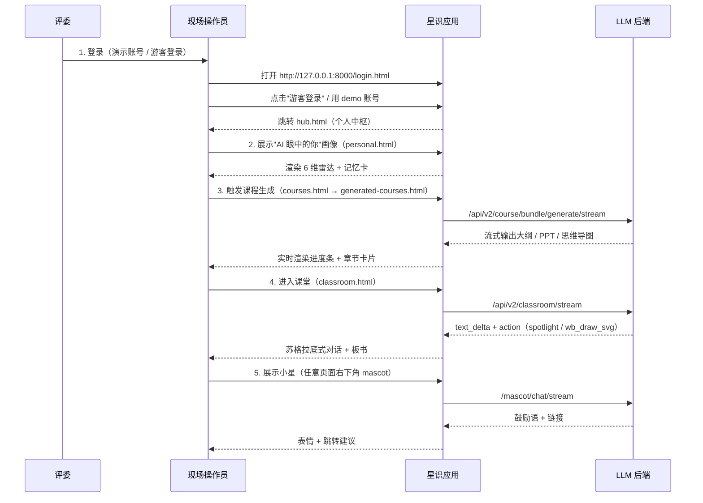

# 演示现场手册

## 摘要

本文档面向答辩评委与现场演示操作员：5 分钟闭环演示路径、关键页面截图点、风险预案、网络/硬件失败回退方案。理解演示节奏与"看什么"，可以 5 分钟内展示"个人智能学习中枢"的核心亮点。

## 前置知识

- [项目说明.md](项目说明.md)
- [部署与运维.md](部署与运维.md) — 启动 + demo 重置

## 内容

### 演示 5 分钟闭环（推荐路径）



### 演示路径详细步骤

**准备**：

```bash
bash scripts/reset_demo.sh    # 重置 demo 数据
python main.py &              # 启动应用
```

**第 1 步 · 登录（30 s）**：

- 打开 http://127.0.0.1:8000
- 点"游客登录"或 demo 账号（`demo` / `demo123` 或 seed 数据中的测试账号）
- 跳转到 hub.html（个人中枢），展示液态玻璃 + 6 主题切换

**第 2 步 · 画像（30 s）**：

- 进入 personal.html
- "AI 眼中的你"卡片：6 维雷达图 + 4 张记忆卡
- 强调"基于历史记忆聚合"——`profile_aggregator.py` + `portrait_aggregator.py`

**第 3 步 · 课程生成（60 s）**：

- 进入 generated-courses.html
- 输入主题（如"图神经网络"），点生成
- 展示 `/api/v2/course/bundle/generate/stream` SSE 流：进度条 → 大纲 → PPT → 思维导图
- 强调"9 组件 bundle：outline / plan / PPT / graph / radar / project / case / exercises / survey"

**第 4 步 · 课堂（90 s）**：

- 进入 classroom.html
- 选生成的课程 → 进入会话
- 展示苏格拉底式对话：5 种 persona 切换（右上角）、socratic_intensity 实时调整
- 板书（`wb_draw_svg` action）+ 重点高亮（`spotlight`）

**第 5 步 · 小星陪伴（30 s）**：

- 任意页面右下角"小星"浮动
- 点击 → "今天学了 90 分钟，专注度 87%！要不要复习一下昨天的递归？"
- 强调 `[navigate:...]` `[expression:...]` 命令标记

### 关键看点（评委常问）

| 问题 | 看点 / 答案 |
|---|---|
| "多智能体在哪？" | classroom 步骤 + agent_orchestration.html（5 阶段流水线）|
| "防幻觉？" | AuditAgent 4 层防御（截图 backend 日志）；`audit_*.py` 巡检 |
| "数据安全？" | 演示账号无登录；JWT + bcrypt 密码（`app/api/auth.py`）；CSP + OriginCheck 中间件 |
| "能离线吗？" | SQLite 默认本地；演示不依赖外网（除 LLM）|
| "多 LLM 切换？" | 默认 MiniMax；XUNFEI_API_KEY 配置即可切换 |

### 风险预案

| 风险 | 预案 |
|---|---|
| LLM 调用超时 | 提前缓存 demo 课程（SSE 流录屏）；预生成 `storage/courses/<demo_id>/` 内容 |
| 网络断开 | 切离线 SQLite + 预录 demo；展示 UI 静态部分 |
| 投影不显示 | 备用 USB-C 转 HDMI；提前测试分辨率 |
| 评委追问未准备问题 | 引导到 architecture-blueprint.html / stellar-showcase.html（"看看其他能力"）|
| 现场启动失败 | `scripts/health_check.sh` + `bash scripts/reset_demo.sh` |

### 演示数据管理

- 演示账号：`scripts/seed_demo.py` 注入
- 演示课程：`storage/seed/demo/*.json` + `manifest.json`（含 `demo_version`）
- 升级：`demo_version` bump（如 2.0.0 → 2.0.1），下次启动自动替换
- 用户私有数据完全不受影响（`storage/state_storage/<user_id>/` 与 demo 路径分离）

### 演示后清理

```bash
bash scripts/reset_demo.sh    # 重置 demo
bash scripts/backup.sh        # 备份日志
```

## 代码定位

- Demo 种子：`app/services/demo_seeder.py`、`scripts/seed_demo.py`
- 演示路径触发：`app/services/demo_runner/`、`app/api/demo_path.py`
- 课程生成：`libs/course.py`
- 课堂流：`app/api/classroom.py`、`app/services/teacher/pipeline.py`
- 小星：`app/api/mascot.py`、`app/services/mascot/`
- 主题切换：`static/js/theme.js`、`static/css/tokens.css`

## 常见坑

- **首次启动慢**：lifespan 跑 demo 种子 + KB _COUNTER hydrate；首次启动 30-60 s
- **SSE 流断**：Nginx 反代场景下必须 `proxy_buffering off`；本地无影响
- **缓存冲突**：演示后不清缓存，下次可能显示旧数据；用 `reset_demo.sh`
- **LLM 限流**：高频切换 persona 可能触发 MiniMax 限流；演示前预热

## 相关链接

- [项目说明.md](项目说明.md)
- [架构设计.md](架构设计.md) — 总图
- [智能体与流水线.md](智能体与流水线.md) — 6 Agent
- [子系统详解.md](子系统详解.md) — 课堂/小星
- [部署与运维.md](部署与运维.md) — demo 重置
- [脚本索引.md](脚本索引.md)